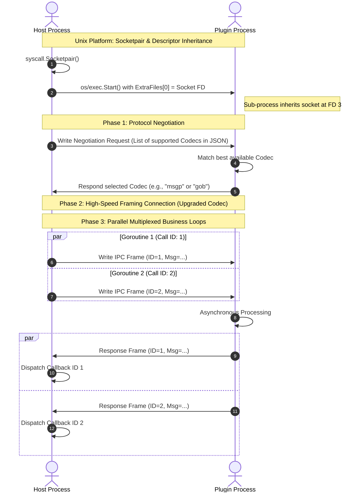

# Plugo: High-Performance Concurrent IPC Plugin Framework

> [中文说明](README_zh.md)

Plugo is an elegant, lightweight, and robust process-level plugin framework built in Go. It supports seamless IPC (Inter-Process Communication) with zero network overhead on Unix (Linux/macOS) systems via raw descriptor passing, and utilizes native anonymous pipes (`CreatePipe`) with inherited handles on Windows.

It supports **Dynamic Codec Negotiation** (JSON, GOB, MessagePack, etc.) at startup and provides highly concurrent, thread-safe, multiplexed communication between the host application and its sub-process plugins.

---

## 1. Key Features

- **High-Performance Unix IPC**: Uses `syscall.Socketpair` to build a bidirectional zero-overhead streaming socket. The sub-process inherits the socket descriptor as file descriptor `3` (`ExtraFiles`).
- **Windows Transparent IPC**: Gracefully adapts to Windows environments using high-speed native anonymous pipes (`CreatePipe`). Read and write handles are securely inherited by the sub-process and passed via environment variables without requiring networking overhead or manual port configuration.
- **Automatic Protocol Negotiation**: During initialization (`Open` / `Attaching`), the host and plugin automatically negotiate the codec. Both sides configure priority queues, and the protocol engine selects the highest-priority supported codec.
- **Raw Data I/O**: `WriteData` and `ReadData` interfaces allow direct transmission and reception of raw `[]byte` payloads over the connection handle.
- **High Concurrency & Multiplexing**: Built-in concurrent-safe framing (`MessageConn`) supporting multiple goroutines sending requests simultaneously with asynchronous callback dispatching. Additionally, `Stream` provides fully independent full-duplex communication natively supporting **Single-to-Multi**, **Multi-to-Single**, and **Multi-to-Multi** bidirectional streaming modes over a single physical connection.
- **Extensive Polyglot Examples**: Features modular examples written in Go (JSON and MsgPack via `runner.go`) and high-performance zero-allocation examples written in Zig 0.16.0 (JSON and MsgPack via the reusable `plugz.zig` module).

---

## 2. Architecture & Design



---

## 3. Directory Structure

```text
plugo/
├── client.go           # Client initialization (Unix FD 3 / Windows Env Handles)
├── codec.go            # Encoder/Decoder interfaces (JSON, GOB)
├── conn.go             # Thread-safe framing connection (BigEndian length-prefix)
├── conn_routing.go     # High-level multiplexed RPC stream routing (Single-Multi, Multi-Single, Bidi)
├── negotiate.go        # Protocol negotiation engine (JSON handshake)
├── plugin.go           # Plugin lifecycle management
├── plugin_unix.go      # Unix-specific SocketPair launcher
├── plugin_windows.go   # Windows-specific anonymous pipe IPC launcher
├── stream.go           # Multiplexed Stream implementation (Send, Recv, CloseWrite, etc.)
├── plugo_test.go       # Core library integration tests
└── examples/           # Full ecosystem showcase
    ├── shared/         # Common cross-language schemas (IPCReqMessage / IPCRespMessage)
    ├── plugin_go/      # Go-based plugin implementations
    │   ├── json/       # Pure Go JSON IPC Plugin
    │   ├── msgp/       # Go MessagePack IPC Plugin (tinylib/msgp)
    │   └── runner.go   # Common plugin orchestrator module for Go
    ├── plugin_zig/     # Zig 0.16.0 based plugin implementations
    │   ├── json/       # Zig JSON IPC Plugin
    │   ├── msgp/       # Zig MessagePack IPC Plugin (using zig-msgpack)
    │   └── plugz.zig   # Reusable Zig IPC library matching Go's lifecycle
    ├── host_go/        # Concurrently dispatching Host orchestrator
    └── Makefile        # Intelligent build system with cross-compilation target mapping
```

---

## 4. Quick Start

### Build All Executables

Compile the host orchestrator and all plugins:

```bash
cd examples
make build
```

*(Note: The Makefile gracefully checks for the Zig compiler. If Zig is missing, it skips the Zig plugins and proceeds with the Go plugins.)*

### Run the Orchestrator

Execute the host process from the `examples` directory:

```bash
cd examples
make run
```

The orchestrator runs two distinct stages:
1. **Standard Concurrency Validation**: Launches all plugins, negotiates their protocols, dispatches multiple RPC requests in parallel with deeply nested schemas, and logs latencies.
2. **Stream Routing & Multiplexing**: Connects to the Go MessagePack plugin and performs concurrent independent bidirectional, single-multi, and multi-single streaming tasks over a single physical connection using the new routing features.
