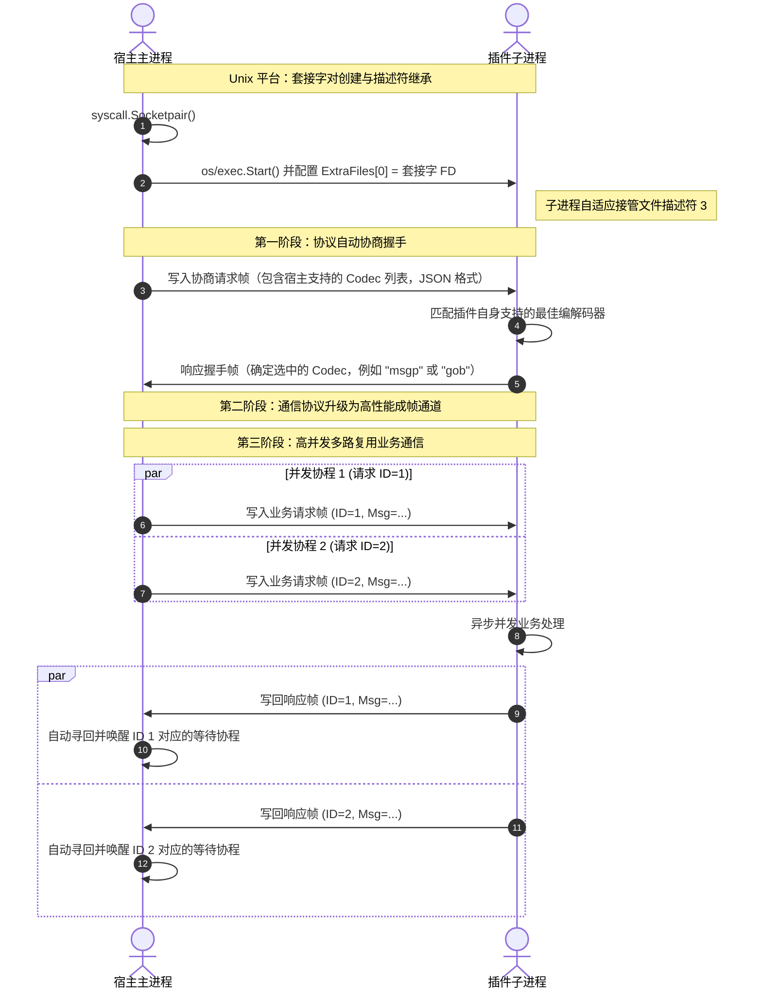

# Plugo: 高性能并发 IPC 进程级插件框架

Plugo 是一个基于 Go 语言实现的优雅、轻量级的进程级插件通信框架。它能够在 Unix (Linux/macOS) 系统上通过原生描述符继承机制实现零网络开销、极速的套接字（Socketpair）通信，并在 Windows 环境下无缝切换为基于 `CreatePipe` 的原生匿名管道通信，通过环境变量安全传递句柄，从而保证跨平台的高效与一致性。

框架内置了 **通信协议自动协商（Negotiation）** 引擎，宿主进程服务与插件客户端可在启动首帧握手阶段自适应选择最优的序列化方式（如升级为二进制 MessagePack/GOB，或降级为通用的 JSON），并转换为高并发安全、基于成帧设计的多路复用（Multiplexing）消息流通道。

---

## 1. 核心特性

- **极致性能的 Unix IPC**：利用 `syscall.Socketpair` 创建全双工、零网络栈开销的本底流式套接字，子进程通过 `ExtraFiles` 继承文件描述符 `3` 直接接管，效率极高。
- **透明的 Windows 管道通信**：在 Windows 平台上自动采用 `CreatePipe` 机制建立高速本地匿名管道通信，子进程通过继承句柄及环境变量 (`PLUGO_PIPE_READ` / `PLUGO_PIPE_WRITE`) 进行安全接管，规避网络栈开销与端口冲突问题。
- **通信协议自动协商**：宿主进程与插件在启动初始化期间（`Open` / `Attaching`）自动发起编解码协商。两端配置各自支持的优先级队列，协议引擎将自动选定两端交集中优先级最高的编解码器。
- **原生数据直读直写**：提供 `WriteData` 和 `ReadData` 接口，允许在连接句柄上单次直接发送和接收原始 `[]byte` 数据（非 Stream 方式）。
- **高并发多路复用**：内置支持并发安全成帧控制的 `MessageConn`。主进程通过单一连接分发多路并发 Goroutine 调度请求，后台读取器自动根据消息唯一 ID 唤醒等待的通道，防范死锁且多写绝对安全。同时，基于 `Stream` 的全双工流式架构原生完美支持：**“单发多收”**、**“多发单收”** 和 **“多发多收（全双工）”** 等高级双向流通信模式。
- **多语言集成范例**：提供提取了公共组件 `runner.go` 的 Go 语言插件示例（JSON 与 MessagePack），以及封装了通用 `plugz.zig` 库的 Zig (0.16.0) 高性能插件生态（其中 MessagePack 支持由第三方 `zig-msgpack` 强力驱动）。

---

## 2. 架构设计与时序流



---

## 3. 目录结构说明

```text
plugo/
├── client.go           # 客户端初始化模块（自动识别 Unix FD 3 / Windows 环境变量管道句柄）
├── codec.go            # 编解码器接口规范（内置 JSONCodec、GobCodec）
├── conn.go             # 线程安全的长度前缀成帧套接字连接（大端序长度前缀）
├── conn_routing.go     # 高级多路复用 RPC 流路由（支持单发多收、多发单收、双向流）
├── negotiate.go        # 协议自动协商引擎实现（首帧 JSON 握手）
├── plugin.go           # 插件通用生命周期控制器
├── plugin_unix.go      # Unix 平台下 SocketPair 启动继承的具体实现
├── plugin_windows.go   # Windows 平台下匿名管道 (CreatePipe) 创建与句柄继承的具体实现
├── stream.go           # 多路复用流的具体实现（支持安全读写及半关闭操作）
├── plugo_test.go       # 核心通信库集成单元测试 (高覆盖率)
└── examples/           # 完整的多语言插件示例生态
    ├── shared/         # 公共跨语言数据模型定义（复杂嵌套 IPC 结构 IPCReqMessage/IPCRespMessage）
    ├── plugin_go/      # Go 语言实现的插件核心逻辑与示例
    │   ├── json/       # 纯 Go 编写的 JSON 协议插件
    │   ├── msgp/       # Go 编写的 MessagePack 协议插件
    │   └── runner.go   # Go 插件通用运行器生命周期封装
    ├── plugin_zig/     # Zig 0.16.0 实现的插件核心逻辑与示例
    │   ├── json/       # Zig 编写的 JSON 协议插件 (内置 std.json)
    │   ├── msgp/       # Zig 编写的 MessagePack 协议插件 (引入 zig-msgpack 库)
    │   └── plugz.zig   # Zig 公共协议封装库，实现与 Go 互通的运行时生命周期
    ├── host_go/        # 宿主并发调度管理器示例
    └── Makefile        # 自动化构建脚本，支持自动检测 Zig 环境及跨平台交叉编译
```

---

## 4. 极速体验

### 1. 编译宿主与插件

在仓库中运行以下命令，完成所有目标的编译：

```shell
cd examples
make build
```

*(注：Makefile 中会自动检测本地是否安装 Zig 编译器；若无 Zig，则自动跳过 Zig 插件的编译和运行。)*

### 2. 运行通信演示

```shell
cd examples
make run
```

宿主服务将依次运行以下演示阶段：
1. **基础并发调度测试**：并行拉起各个插件，自动与它们进行双向协议握手，通过不同的编码通道发起极高并发的深度嵌套结构化调度。
2. **多路复用长流展示**：在同一物理通道上同时启动全双工流 (Bidirectional)、单发多收流 (Server-Streaming)、多发单收流 (Client-Streaming)，演示极低延迟的数据分发。

---

## 5. 使用示例 (Usage)

### 宿主程序 (Host)

```go
package main

import (
	"context"
	"log/slog"
	"os"

	"github.com/yougg/plugo"
)

func main() {
	// 1. 启动并连接插件子进程，指定支持的编解码器
	plugin, err := plugo.Open(context.Background(), "./my-plugin", plugo.WithCodec(plugo.JSONCodec{}))
	if err != nil {
		slog.Error("启动插件失败", "error", err)
		os.Exit(1)
	}
	defer plugin.Close()

	// 2. 向插件发送消息
	type Request struct { Command string }
	err = plugo.WriteMessage(context.Background(), plugin.Conn(), Request{Command: "hello"})
	if err != nil {
		slog.Error("发送消息失败", "error", err)
		os.Exit(1)
	}

	// 3. 接收插件的响应消息
	type Response struct { Reply string }
	resp, err := plugo.ReadMessage[Response](context.Background(), plugin.Conn())
	if err != nil {
		slog.Error("接收消息失败", "error", err)
		os.Exit(1)
	}
	slog.Info("插件回复", "reply", resp.Reply)
}
```

### 插件程序 (Plugin)

```go
package main

import (
	"context"
	"log/slog"
	"os"

	"github.com/yougg/plugo"
)

func main() {
	// 1. 附加到宿主进程，完成握手协商
	conn, err := plugo.Attaching(context.Background(), plugo.JSONCodec{})
	if err != nil {
		slog.Error("附加到宿主失败", "error", err)
		os.Exit(1)
	}
	defer conn.Close()

	// 2. 等待宿主发送消息
	type Request struct { Command string }
	req, err := plugo.ReadMessage[Request](context.Background(), conn)
	if err != nil {
		slog.Error("接收消息失败", "error", err)
		os.Exit(1)
	}
	slog.Info("宿主发送", "command", req.Command)

	// 3. 返回响应消息给宿主
	type Response struct { Reply string }
	err = plugo.WriteMessage(context.Background(), conn, Response{Reply: "world"})
	if err != nil {
		slog.Error("发送响应失败", "error", err)
		os.Exit(1)
	}
}
```

### 编译与运行该示例

若要运行上述简易示例，可按照如下结构组织您的代码：

1. **创建目录结构**：

   ```text
   my-project/
   ├── host/
   │   └── main.go  # 写入上述 宿主程序 (Host) 代码
   └── plugin/
       └── main.go  # 写入上述 插件程序 (Plugin) 代码
   ```

2. **初始化 Go 模块**：

   初始化一个新的 Go 模块：
 
   ```shell
   go mod init my-project
   go mod tidy
   ```

3. **编译插件程序**：

   宿主程序在启动时会加载当前执行目录下的 `./my-plugin` 可执行文件。您需要将插件编译并输出到 `host` 目录下：

   ```shell
   go build -o ./host/my-plugin ./plugin
   ```

4. **运行宿主服务**：

   进入 `host` 目录并运行宿主进程：

   ```shell
   cd host
   go run main.go
   ```
